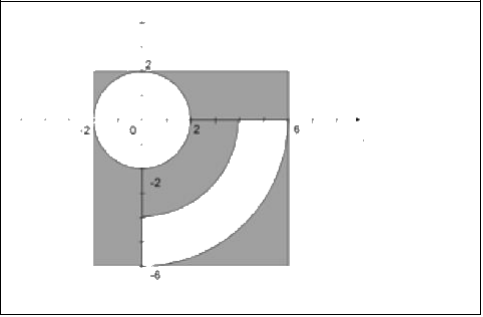
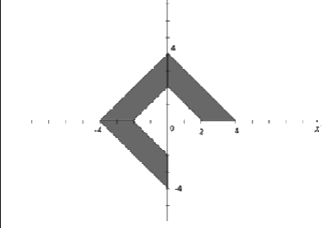
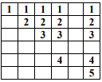
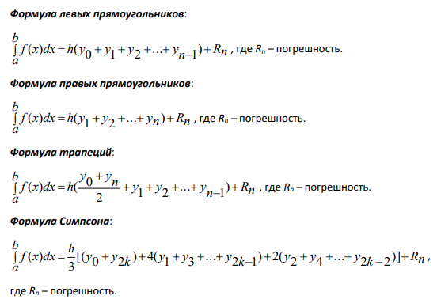

# 📚Zhdanovich-education

---
# 🐍Fundamentals of Software Engineering
<details>
    <summary style="font-weight: bold; font-size: large">Нажмите, чтобы развернуть список лабораторных</summary>

## 📚 Лабораторная работа №2 Типы данных Python. Приведение типов. Решение задач на работу с числовыми данными. (folder Lab_2)

<details>
    <summary style="font-weight: bold; font-size: large">Нажмите, чтобы развернуть условия и решения</summary>

---
**_A4._** Напишите программу, которая считывает два целых числа A и B и выводит наибольшее из них.  
Числа — целые от 1 до 1000.  
ВАЖНО: можно пользоваться только целочисленными арифметическими операциями (без ветвлений, циклов, функций).   
Решение → `A4.py`
---
**_A5._** Проверить, делится ли число A на число B нацело без использования ветвлений и функций.  
Вывести `YES`, если A кратно B, иначе `NO`.  
Решение → `A5.py`
---
_**A6.**_ Электронные часы: по числу секунд с начала суток вывести время в формате `h:mm:ss`.  
Решение → `A6.py` 
---
**_A7._** По координатам двух клеток шахматной доски определить: одинаковый ли цвет (YES/NO) и если одинаковый — вывести цвет (White/Black). Клетка (1,1) — белая.  
Решение → `A7.py`
---

**_B1._ Расстояние по карте.** \
Чтение из файла `inmapX.dat`:  
1) N — количество локаций (1–100)  
2) Масштаб (миль на дюйм)  

Далее — расстояния (в дюймах) между последовательными точками.  
Вывести таблицу с перерасчётом и итог.  

Пример входных данных:
```
4  0.25
1.5
2.3
5.9
4.0
```
Требуется найти расстояние, которое придется проехать (в милях), чтобы посетить все локации, а
также найти расстояние между двумя соседними (в милях).

### Вывод в формате:
```
Ivan Zhdanovich 
Simple Map Distance Computations

Map Scale Factor:    0.25 miles per inch

      Map       Mileage
      Measure   Distance
=============================================================
#  1    1.5       0.4
#  2    2.3       0.6
#  3    5.9       1.5
#  4    4.0       1.0
=============================================================
Map Total Distance:   3.5 miles
```

Решение → `B1.py` 

### Примечание:
Заметка: в Python 3.13 `round()` округляет X.5 к ближайшему чётному.  
Перед началом укажите путь к файлу в строке:
`with open('Path/to/file.dat', 'r', encoding='utf-8') as file:`

---

**_B2._ Фактор охлаждения ветром (Wind Chill).**  
Чтение измерений из `X.WCData.txt`: время, температура воздуха, скорость ветра.  
Рассчитать скорректированную температуру (WC temp), WC Effect и среднее скорректированное значение.  
Результат записывается в `X.WindChillReport.txt`.  
Решение → `B2.py`  

### Фрагмент входа:

```
Time          Air Temp    Wind Speed
------------------------------------
00:00:55           36             27
00:30:22           33             36
01:00:52           29             40
01:30:14           29             39
```

Программа должна сформировать файл `X.WindChillReport.txt`, содержащий результаты
вычислений в следующем виде:


```
Time     WC temp     WC Effect
------------------------------
00:00:55    23.3         -12.7
00:30:22    17.6         -15.4
01:00:52    11.4         -17.6
------------------------------

The average adjusted temperature, based on 13 observations, was 8.4
```

#### Примечание: 
Т.к для решения использовался Python 3.13: функция round() округляет числа типа Х.5 до ближайшего четного.
Так же перед началом надо указать путь до вашего файла с данными в переменной `Path_to_File_with_data`
Программа записывает результат вычислений в новом файле, если надо название файла не по форме `X.WindChillReport.txt`
или надо изменить путь где будет создан этот файл, надо заменить путь и название в переменной `Path_to_new_file_result`.


</details>

## 📚 Лабораторная работа №3 Реализация алгоритмов ветвления. Условные операторы. (folder Lab_3)

<details>
    <summary style="font-weight: bold; font-size: large">Нажмите, чтобы развернуть условия и решения</summary>

**_A1._**   Определить лежат ли точки в одной четверти.  
Входные данные: x1, y1, x2, y2 — координаты двух точек (не на осях).  
Вывести `YES`, если в одной четверти и указать четверть, иначе `NO`.
Решение → `A1.py`
---
**_A2._**  Напишите программу, которая проверяет введенный пароль на надежность. Требования к
надежному паролю следующие:
• Длина пароля – 8 символов
• В пароле должны быть заглавные и строчные буквы, цифры и специальные символы: *, - , #
Решение → `A2.py`
---
**_A3._**  Напишите программу, которая по двум показаниям счетчика (предыдущее и текущее) определяет
объем использованного газа в кубометрах, вычисляет сумму оплаты за газ и среднюю цену за
кубометр. Сумму оплаты и средней цены за кубометр округлите при выводе до двух знаков после
запятой.
Решение → `A3.py`


### **_B1._ Кот и мышь.** 
Кот и мышь двигаются по прямоугольной сетке, каждая клетка — пара координат (строка, столбец).
Оба игрока могут перемещаться по вертикали и горизонтали, не выходя за границы: если выходят — оказываются на 
противоположной стороне. Если кот и мышь оказываются в одной клетке одновременно, кот ловит мышь и игра заканчивается.
Программа читает начальные позиции и ходы из файла, вычисляет расстояния между игроками, суммарные пройденные пути
и определяет исход: «Кот поймал мышь» или «Мышь сбежала».
Чтение из файла `X.ChaseData.txt`:  
### Формат входных данных:
```
Первая строка – два целых числа (количество строк и столбцов сетки)
Каждая следующая строка представлена в одном из следующих
форматов:
M <число> <число> // начальная позиция или ход мыши
C <число> <число> // начальная позиция или ход кота
P // команда вывода на экран (print) текущего состояния игры 

   29   15
C        18         3
M         1        11
M        13        -3
P
M        -4        -1
P
M        -4        -2
P
C         9        -2
```
### Формат выходных данных: 

```
Первая строка – название игры
Вторая строка – пустая
Третья строка – названия столбцов таблицы
Четвертая строка – строка разделительных символов
Пятая и следующие строки – позиции кота и мыши и расстояние
между ними. Если на момент выполнения команды P позиция
игрока неизвестна, то выводим ( ?, ?).
Под таблицей выводятся расстояния, пройденные обоими
игроками, а также исход игры. 

Cat and Mouse

  Cat        Mouse    Distance
------------------------------
(18, 3)     (14, 8)       9
(18, 3)     (10, 7)      12
(18, 3)     ( 6, 5)      14
(27, 1)     ( 6, 5)      25
(10, 1)     (28,15)      32
(10, 1)     ( 3, 1)       7
( 6, 1)     ( 3,13)      15
( 5, 4)     ( 3,13)      11
( 9, 5)     ( 3,13)      14
( 9, 5)     ( 9,10)       5
------------------------------


Distance   Mouse    Cat
              66     42

Mouse evaded Cat
```
Решение → `B1.py` 

### Примечание:
Перед началом укажите путь к файлу в строке:
`with open('Path/to/file.dat', 'r') as file:`

</details>


## 📚 Лабораторная работа №4 Операторы цикла. Циклические алгоритмы. (folder Lab_4)

<details>
    <summary style="font-weight: bold; font-size: large">Нажмите, чтобы развернуть условия и решения</summary>

**_A1._**   Создайте тренажёр для изучения таблицы умножения. Программа задаёт N случайных
примеров на умножение, ожидает ответа пользователя на каждый пример, подсчитывает
количество правильных ответов, затраченное время на каждый пример и на все примеры. После
того как пользователь решит все примеры, программа выдает подробную статистику:\
• Общее время, затраченное на ответы (сек.)\
• Среднее время на один пример (сек.)\
• Количество правильных ответов\
• Процент правильных ответов\
В случае, если пользователь вводит ответ, не являющийся целым числом, программа повторяет тот
же пример, пока пользователь не введет целое число (см.пример работы программы)
```
Введите количество примеров: 5
Вопрос 1/1
2 × 7 = 15
Неверно! Правильно: 14 (Время: 2.9 сек)
Вопрос 2/2
4 × 6 = 24
Верно! (Время: 2.2 сек) 
==================================================
СТАТИСТИКА:
==================================================
Общее время: 5.1 секунд
Среднее время на вопрос: 2.5 сек
Правильных ответов: 1/2
Процент правильных: 50.0%
```
Решение → `A1.py`

---
**_A2._**  Используя вложенные циклы, изобразите следующие фигуры:\
• Прямоугольник, размером n*m (размеры вводятся с клавиатуры)\
• Правый треугольник, состоящий из n строк\
• Рамку, размером n * m\

```angular2html
ПРЯМОУГОЛЬНИК 5x10:                     
##########
##########
##########
##########
##########
ПРАВЫЙ ТРЕУГОЛЬНИК:
#
##
###
####
#####
РАМКА 5*10:
##########
#        #
#        #
#        #
##########
```
Решение → `A2.py`

**_A3._**  Вы - сетевой администратор, который в процессе мониторинга сети зафиксировал
последовательности успешно доставленных (1) и потерянных (0) пакетов данных. Разработайте
программу, для анализа этих последовательностей и выявления критических периодов потерь
данных.
Программа должна проанализировать последовательность из нулей (0) и единиц (1), где 1 – пакет
успешно доставлен, 0 – пакет потерян. Требуется:\
• Осуществить ввод строки, состоящей из 0 и 1. Длина строки должна быть не меньше 5.\
• Осуществить проверку корректности ввода, убедившись, что в строке используются только
символы 0 и 1.\
• Найти общее количество пакетов (это длина входной строки).\
• Найти общее количество потерянных пакетов (количество нулей).\
• Найти длину самой длинной последовательности потерянных пакетов (подряд идущих
нулей).\
• Вычислить процент потерь: (Количество потерянных пакетов / Общее количество пакетов) ×
100%\
• Оценить качество связи. Если процент потерь:\
0-1% - Отличное качество\
1-5% - Хорошее качество\
5-10% - Удовлетворительное качество\
10-20% - Плохое качество\
\>20% - Критическое состояние сети\

##### Пример работы программы:

Ввод:\
1101000110100011000001101101000110100000001110101\
Вывод:\
• Общее количество пакетов: 49 \
• Количество потерянных пакетов: 28 \
• Длина самой длинной последовательности потерянных пакетов: 7 \
• Процент потерь: 57.1% \
• Качество связи: критическое состояние сети\
Решение → `A3.py`

**_A4_** Задача на проверку корректности номеров карт используя алгоритм Луна.
В файле card.data лежат "случайные" номера банковских карт. Код проверяет валидность 
карт и выводит тип карты в случае валидности или предупреждение об инвалидности карты.\
Решение → `A4.py`

### **_B1._ Мониторинг осадков. ** 
Национальный центр климатических данных нанял Вас для написания
программы, генерирующей отчет по суточным объемам осадков. Проблема в том, что
компьютерный сбой привел к тому, что некоторые данные в исходных файлах отображаются в
неправильном порядке, потеряны или имеют неверно записанную дату. Вам необходимо
распознать ошибки в файле данных и отобразить сводку о суточных объемах осадков за указанный
месяц.

#### Входной файл.
Входной файл для этой программы называется Precip.txt. Первая строка файла содержит
информацию, которую не нужно обрабатывать. Вторая строка содержит местоположение
метеостанции, сообщающей об осадках. Третья строка содержит полное название месяца (с
заглавной буквы) и через запятую год, в котором фиксировались данные об осадках. Четвертая и
последующие строки содержат день и количество осадков в дюймах, зарегистрированное в этот
день.

### Формат входных данных:

```
CS1044 Project 5 Fall 2008
Blacksburg, VA
December, 2006
2  0
4 0
5 0
26 0
6 0
8	0.01
9 0
10	0.02
13 0
114 0
15 0
17 0.55
19	1.8
8 0.08
20 	4.12
24 0
32 0.73
28 0
11    0.05
12 0.01
29 0
```

Ваша программа должны считать информацию об осадках и вычислить минимальное,
максимальное и среднее значения количества осадков.\
Входной файл может содержать два типа ошибок. Первый тип (Invalid): день, указанный во входных
данных, может быть недопустимым для указанного месяца. Второй тип (Repeated): файл может
содержать несколько записей для одного и того же дня.\
Эти ошибки должны распознаваться, и должно выводиться сообщение об ошибке, содержащее
номер строки, в которой обнаружена ошибка. Смотрите ниже пример выходного файла Report.txt.
Там указан точный формат вывода сообщений об ошибках.


#### Выходной файл:
Выходной файл называется Report.txt. Пример выходного файла, соответствующий приведенному
входному файлу, показан ниже. Первые две строки содержат информацию о программисте и
проекте. Третья строка пустая. Четвертая строка содержит местоположение, месяц и год. Пятая
строка пустая. Остальная информация выводится в следующем порядке:

• Список всех ошибок, обнаруженных в файле.

• Гистограмма количества осадков. Выводится день и количество осадков с точностью до двух
знаков. Далее в этой же строке отображается график, содержащий одну звездочку (*) для
каждых 0.25 дюйма или их части. Например, осадки в количестве 0.01 - 0.25 дюйма 
отображаются одной звездой, 0.26 - 0.50 – две звезды, 0.51 - 0.75 – три звезды и т.д. Если
данные об осадках за день недоступны, вместо их количества выводим "NA".
• Максимальное, минимальное и среднее количество осадков. Если за весь месяц нет
доступной информации, для всех трех значений должно быть выведено "NA".

### Формат выходных данных: 
```
Programmer: Ivan Zhdanovich
CS 1044 Project 5 Fall 2008

Precipitation report for Radford, VA during December, 1996

Error         Day       Line
Invalid        75          4
Invalid        43          5

Day Amount Graph
  1   6.64 ***************************
  2     NA
  3     NA
  4   1.57 *******
  5     NA
  6     NA
  7     NA
  8     NA
  9     NA
 10     NA
 11     NA
 12   6.03 *************************
 13   4.39 ******************
 14   4.71 *******************
 15   9.88 ****************************************
 16   3.83 ****************
 17   0.29 **
 18   0.45 **
 19     NA
 20     NA
 21     NA
 22     NA
 23     NA
 24   1.73 *******
 25   3.13 *************
 26     NA
 27   0.00 
 28     NA
 29   9.56 ***************************************
 30     NA
 31     NA

Minimum     Maximum     Average
   0.00        9.88        1.68
```

Решение → `B1.py` 

### Примечание:
Путь к входному файлу указать в переменной `path_to_file_in = "file_B/Precip2.txt"`\
Путь до выходного файла указать в переменной `path_to_file_out = 'file_B/02Report.txt'`

</details>


## 📚 Лабораторная работа №5: Работа со строками. Анализ и обработка текстовых данных (folder Lab_5)
<details>
    <summary style="font-weight: bold; font-size: large">Нажмите, чтобы развернуть условия и решения</summary>

**_A1._** Напишите программу, которая укорачивает входной текст, удалив из текста все, что написано в
круглых скобках, включая сами скобки. Для решения задачи, реализуйте функцию, которая
получает на вход исходный текст, а возвращает – укороченный.\
Пример работы программы:\
Исходный текст: Падал (куда он там падал) прошлогодний (значит очень старый) снег (а почему не
дождь) () (()).
Укороченный текст: Падал прошлогодний снег.\
Решение → `A1.py`

---
**_A2._**  Дан текст, состоящий из предложений. Предложения текста заканчиваются символами точка,
восклицательный или вопросительный знак. Найдите количество предложений в тексте и выведите
все предложения на экран, по одному в каждой строке. Учтите, что между предложениями может
быть более одного пробельного символа. Лишние пробелы выводить не надо.\
Решение → `A2.py`
---
**_A3._**  Исходный текст состоит из слов, разделенных пробелом. Требуется получить строку, которая
состоит только из первых букв каждого слова (аббревиатура). Дополнительные условия:\
• Все буквы аббревиатуры должны быть в верхнем регистре.\
• В аббревиатуру не включаются первые буквы слов, длина которых меньше 3.\
Решение → `A3.py`

---

### _А4._ Генетический поиск
#### Входные файлы.
В этом проекте используются два входных файла. Один файл `sequences.txt` содержит
генетические данные, а другой файл `commands.txt` - содержит команды, которые необходимо
выполнить над этими данными.
Во входном файле sequences.txt каждая строка содержит название белка, название
организма, в котором он обнаружен, и цепочку аминокислот. Данные разделены символом
табуляции. На рисунке ниже представлен пример файла `sequences.txt`. Знаком → обозначен символ
табуляции, а знаком ¶ - символ конца строки.\
Во входном файле` commands.txt `каждая строка содержит название операции, которую
необходимо выполнить над входными данными файла `sequences.txt`. 
#### Формат входных данных:
Возможные операции:
`search`, `diff`, `mode`. У каждой операции есть параметры.\
Цепочка аминокислот может быть закодирована с использованием простой техники сжатия
Run-Length Encoding (RLE) - кодирование повторов. RLE - это алгоритм сжатия данных, заменяющий
повторяющиеся символы (серии) на один символ и число его повторов. Серией называется
последовательность, состоящая из нескольких одинаковых символов. Рассмотрим следующий
фрагмент гена обыкновенной плодовой мухи:\
`AAAAAAAATATTTCGCTTTTCAAAAATTGTCAGATGAGAGAAAAAATAAAA`\
Кодирование этого фрагмента с использованием алгоритма RLE дает следующую
последовательность:
`8ATA3TCGC4TC5ATTGTCAGATGAGAG6AT4A`\
Обратите внимание, что последовательностям из 1-ой или 2-х одинаковых букв не
предшествует цифра. Такие серии не кодируются, так как это не приведет к сжатию данных.
Считайте также, что ни одна белковая последовательность не содержит цепочек, состоящих более
чем из 9 одинаковых букв.

### Функции из commands.txt:
#### Операция 🔍search: 
В случае успешного выполнения:
``` 
--------------------------------------------------------------------------
002   search   LKSQ
organism                 protein
Homo sapiens (Human)     TRAF interacting protein TANK isoform b
--------------------------------------------------------------------------
```
Если последовательность аминокислот не обнаружено:
```
--------------------------------------------------------------------------
003   search   FKIII 
organism		protein 
NOT FOUND
--------------------------------------------------------------------------
```
#### Операция 🔄diff: 
В случае успешного выполнения:
``` 
--------------------------------------------------------------------------
005   diff   RNA-dependent RNA polymerase [Fragment]   Alcohol dehydrogenase 
amino-acids difference: 
115 
--------------------------------------------------------------------------
```
Если белок не обнаружен:
```
--------------------------------------------------------------------------
005   diff   RNA-dependent RNA polymerase [Fragment]   Alcohol dehydrogenase 
amino-acids difference: 
MISSING: Alcohol dehydrogenase
--------------------------------------------------------------------------
```
#### Операция 📊mode: 
В случае успешного выполнения:
``` 
--------------------------------------------------------------------------
006   mode   metallothionein 2A
amino-acid occurs:
C          20
--------------------------------------------------------------------------
```
Если белок не обнаружен:
```
--------------------------------------------------------------------------
006   mode   metallothionein 2A
amino-acid occurs:
MISSING: Alcohol dehydrogenase
--------------------------------------------------------------------------
```
Решение → `А4.py` 

### Примечание:
Путь к входным файлам указать в переменных (строки 99-101): \
`path_file_with_commands = "other_file/commands.1.txt"` \
`path_file_with_data = "other_file/sequences.1.txt"`

Путь до выходного файла указать в переменной `path_to_file_out = "other_file/output.txt"`

</details>

</details>

# C++ Fundamentals of Algorithmization and Programming
<details>
    <summary style="font-weight: bold; font-size: large">Нажмите, чтобы развернуть список лабораторных</summary>

## 📌Лабораторная работа №3 (folder lab_3)

<details>
    <summary style="font-weight: bold; font-size: large">Нажмите, чтобы развернуть условия и решения</summary>

#### Написать ДВЕ программы:

1. Для вычисления площади треугольника, если заданы координаты трех его
вершин (x1, y1), (х2, y2), (x3, y3).\
Решение → `lab_3_2.cpp` 

2. Дано натуральное число Т, которое представляет длительность времени в
секундах. Вывести данное значение длительности в часах, минутах и
секундах в следующей форме: ?? часов ?? минут ?? секунд.\
Решение → `lab_3_7.cpp`

</details>

## 📌Лабораторная работа №4 (folder lab_4)

<details>
    <summary style="font-weight: bold; font-size: large">Нажмите, чтобы развернуть условия и решения</summary>

#### Написать ДВЕ программы. (Определение принадлежности точки с координатами (x,y) заштрихованной области):

1. \
Решение → `lab_4_2.cpp` 

2. \
Решение → `lab_4_5.cpp`

</details>

## 📌Лабораторная работа №5 (folder lab_5)

<details>
    <summary style="font-weight: bold; font-size: large">Нажмите, чтобы развернуть условия и решения</summary>

1. Напишите программу, которая запрашивает у пользователя ввести одну из
следующих 6 букв латинского алфавита: A S D F B R, а затем выводит слово,
которое начинается с этой буквы или сообщение об ошибке, если символ
введен не из предложенного набора.\
Решение → `lab_5_2.cpp` 

2. Напишите программу, которая запрашивает у пользователя ввести одну из
следующих 5 букв латинского алфавита: М S N L B, а затем выводит на
английском языке название белорусского города, которое начинается с этой
буквы или сообщение об ошибке, если символ введен не из предложенного
набора.\
Решение → `lab_5_5.cpp`
</details>

## 📌Лабораторная работа №6 (folder lab_6)

<details>
    <summary style="font-weight: bold; font-size: large">Нажмите, чтобы развернуть условия и решения</summary>

1. ЗАДАНИЕ Используя инструкцию while написать программу для вывода на
экран таблицы значений функции F(x) в диапазоне от х(нач.) до x(конеч.) с шагом dx.\
```F(x) = -2.4x**2 +1/(x+0.5)-sin(x**2) ```\
Решение → `lab_6_1.cpp` 

2. ЗАДАНИЕ Используя инструкцию do … while написать программу
нахождения такого наименьшего n, для которого (1 + 1/2 + 1/3 + … + 1/n) > f(x).
Значение х вводится с клавиатуры, а f(x):\
`f(x) = 2.1-sin(x2-1)`\
Решение → `lab_6_2.cpp`
</details>

## 📌Лабораторная работа №7 (folder lab_7)

<details>
    <summary style="font-weight: bold; font-size: large">Нажмите, чтобы развернуть условия и решения</summary>

1. ЗАДАНИЕ Используя инструкцию for написать программу для вычисления S, где
k вводится с клавиатуры, а S задается формулой:\
`S = (2*i) + (k / (i + 3))`\
Решение → `lab_7_1.cpp` 

2. ЗАДАНИЕ Используя вложенные циклы for написать программу для вывода на
экран чисел следующим образом:\
\
Решение → `lab_7_2.cpp`
</details>

## 📌Лабораторная работа №8 (folder lab_8)

<details>
    <summary style="font-weight: bold; font-size: large">Нажмите, чтобы развернуть условия и решения</summary>

1. ЗАДАНИЕ 8/1. (Приближенное вычисление определенных интегралов).\
Ecли f(x) – непрерывная и дифференцируемая достаточное число раз на
отрезке [a, b] функция и h = (b-a)/n, xk = x0 + kh (k=0,1,2,…,n), yk = f(xk), то имеют
место следующие формулы для приближенного вычисления определенных
интегралов.
\
Написать программу, в которой с помощью формул левых, правых, трапеций
и Симпсона вычислить приближенные значения интегралов функций на указанном
отрезке [a,b]. Значение a и b вводятся с клавиатуры.
Значение k вводится с клавиатуры. Интегралы вычисляются для n=k и n=10k. В
программе предусмотреть вывод значений с 4 цифрами после десятичной точки. В
результате выполнения программы на экран вывести как соответствующие
приближенные значения интеграла, так и точное значение (вычисленное по
соответствующей формуле).\
`f(x) = 1.3x+1.4cos(x)-0.6 на отрезке [0; pi/3]`\
Решение → `lab_8_1.cpp` 

</details>

## 📌Лабораторная работа №9 (folder lab_9)

<details>
    <summary style="font-weight: bold; font-size: large">Нажмите, чтобы развернуть условия и решения</summary>

1. Программу из предыдущего задания преобразовать таким
образом, чтобы вычисление интегралов на основе формул левых, правых, трапеций
и Симпсона было реализовано на основе использования механизма перегрузки
функций.\
Решение → `lab_9_1.cpp` 

</details>

## 📌Лабораторная работа №10 (folder lab_10)

<details>
    <summary style="font-weight: bold; font-size: large">Нажмите, чтобы развернуть условия и решения</summary>

### Задание 2
Напишите программу, в которой реализуйте три варианта
перегрузки функции flip, которая возвращает число, полученное записью всех цифр
задаваемого натурального N в обратном порядке, т.е, если функция принимает в
качестве параметра число 567321, то возвращает число 123765. В первом и втором
варианте функция изменяет само число, в третьем – формирует возвращаемое
значение.\
1 вариант: void flip(int* N)\
2 вариант: void flip(int& N)\
3 вариант: int flip(int N)\
Решение → `lab_10_2.cpp` 

### Задание 3
Иногда возникает необходимость, чтобы функция возвращала не
одно значение, а несколько. Например, по двум сторонам прямоугольника
необходимо вычислить его периметр и площадь. Тогда можно воспользоваться
передачей параметров по ссылке:\
```aiignore
#include <iostream>
using namespace std;
//Функция для вычисления площади и периметра прямоугольника по известным длинам сторон
void P_and_A(double a, double b, double &P, double &A)
{
 P=(a+b)*2;
 A=a*b;
}
int main()
{
 double x=2.5; double y=2.0; // длина сторон прямоугольника
 double P; //Периметр
 double A; //Площадь

 //Вызов функции
 P_and_A(x,y,P,A);

 //Вывод значений периметра и площади
 cout << "Perimeter = " << P << endl;
 cout << "Area = " << A << endl;
 return 0;
}
```
Напишите программу, в которой реализуйте функцию нахождения старшей и
младшей цифры некоторого натурального числа N: void F(int N, int& First, int&
Last).\
Решение → `lab_10_2.cpp`
</details>


## 📌Лабораторная работа №11 (folder lab_11)


<details>
    <summary style="font-weight: bold; font-size: large">Нажмите, чтобы развернуть условия и решения</summary>

### Задание 1 (Метод деления отрезка пополам).
Написать программу, в которой с помощью метода деления отрезка пополам
найти и вывести действительное значение корня на отрезке [a, b] с точностью 0.005.
Значения a и b необходимо предварительно определить (перед выполнением
программы), причем длина интервала [a, b] не должна быть больше 1.
В процессе выполнения программы ввести значения a и b с клавиатуры и
предусмотреть вывод промежуточных результатов вычисления корня с 5 знаками
после десятичной точки.

Функция -> f(x) = x^5-8.3x-4

Решение → `lab_11_5.cpp`

</details>

## 📌Лабораторная работа №12 (folder lab_12)
<details>
    <summary style="font-weight: bold; font-size: large">Нажмите, чтобы развернуть условия и решения</summary>

ЗАДАНИЕ 1. Написать программу, в которой с помощью генератора случайных
значений сформировать 4 одномерных массива array1, array2, array3, array4,
каждый из которых содержит m (где m<=7) целочисленных значений.
Значения элементов массивов формируются в диапазоне [k, +3*k], где значение
3 < k < 9 вводится с клавиатуры.
Вывести на экран все сформированные массивы, и предусмотреть функцию, с
помощью которой затем вывести сумму четных элементов в каждом массиве.\
Решение → `lab_12_1.cpp` 

ЗАДАНИЕ 2. Написать программу, в которой с помощью генератора случайных
значений сформировать одномерный массив вещественных значений, содержащий
n (где n<=10) элементов.
Значения элементов массива формируются в диапазоне [0.5*p, 3.5*p], где
значение p>=2 вводится с клавиатуры.
Вывести на экран сформированный массив и вывести среднее арифметическое элементов, значения которых больше
минимального.\
   Решение → `lab_12_2.cpp`
</details>
</details>


[//]: # (## 📌Лабораторная работа № &#40;folder lab_&#41;)

[//]: # (<details>)

[//]: # (    <summary style="font-weight: bold; font-size: large">Нажмите, чтобы развернуть условия и решения</summary>)

[//]: # (</details>)

[//]: # (![Фотография кота]&#40;./images/cat.png&#41;)
[//]: # (<details>)

[//]: # (    <summary style="font-weight: bold; font-size: large">Нажмите, чтобы развернуть условия и решения</summary>)

[//]: # (</details>)